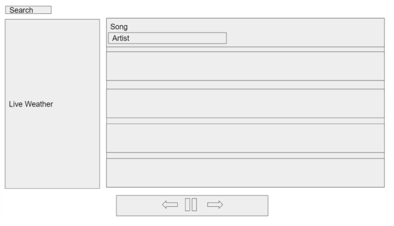

# API Project 1: SpotiWeather

## About This Project

This project was an excercise in using multiple APIs to create a uniquely functioning website using HTML, CSS, and JavaScript. 

The website is an Online Weather Playlist Maker that utilizes openweathermap.org API and YouTube's v3 Data API (found at https://developers.google.com/youtube/v3). The user's inputted location is fed into the Open Weather Map API and returns the current weather of that location. The weather code is then read by JavaScript and develops a search criteria for the YouTube API according to the current weather. This search criteria is sent to the YouTube API and returns video IDs. The video IDs are inserted into the embedded video player to give the user a video or playlist based on the weather from their desired location.

## User Story

```
AS A music lover/ weather enthustiast
I WANT my music to match the current weather in my location
SO THAT I can feel immersed 

AS A student
I WANT my music to match the mood of my environment 
SO THAT I can zone into my work as much as possible

AS A person on vacation
I WANT to find music that goes with the weather during my travels
SO THAT I can hear music that goes well with the mood of the day

AS someone who is stuck inside because of a blizzard
I WANT to hear music that will brighten up my snow day
SO THAT I can drink my hot chocolate to good winter music

AS someone who is just plain bored
I WANT to surf the internet to find music I've never heard
SO THAT I can find the next artist I'm going to become obsessed with
```

## Acceptance Criteria

```
GIVEN an online weather playlist maker
WHEN I search for my city
THEN I am presented with a playlist that matches the current weather in my area
WHEN the playlist loads
THEN the styling of the page changes to match the weather as well
WHEN I search for another city
THEN the playlist and page change to match the weather in that area
```

## How To Use




To use the Online Weather Playlist Maker, or SpotiWeather, first input your city's name into the search bar on the lefthand side. SpotiWeather will then determine the current weather in that location and return a YouTube playlist that matches. For example, if it is rainy in Minneapolis SpotiWeatehr will return a search result for 'rainy day copyright free music' from YouTube. The music is kept copyright free to avoid conflicts while loading the video player. Simply click the play button on the video player to enjoy your music. 

## Access

The Online Weather Playlist Maker, or SpotiWeather, can be accessed at https://tjtahmas.github.io/API-Project-1/

The GitHub repository for this project is available at https://github.com/tjtahmas/API-Project-1

## License

This project was created as part of The Ohio State University Coding Boot Camp


